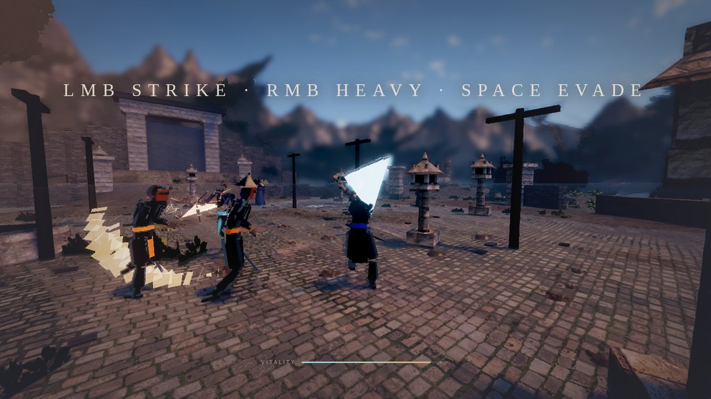
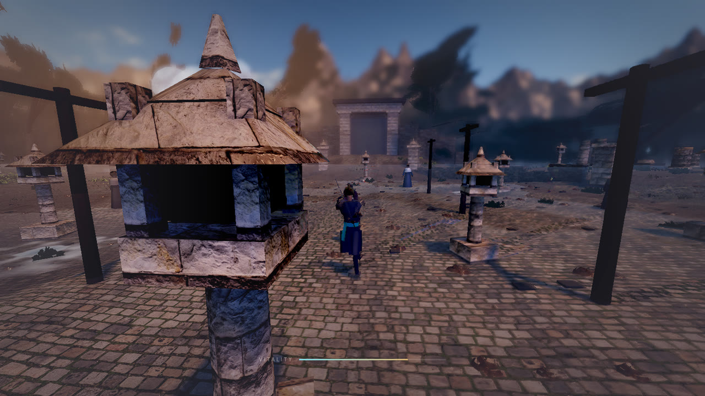
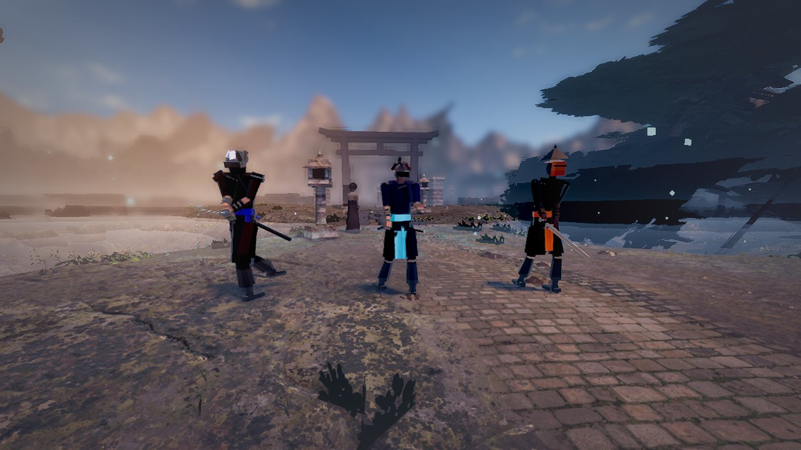
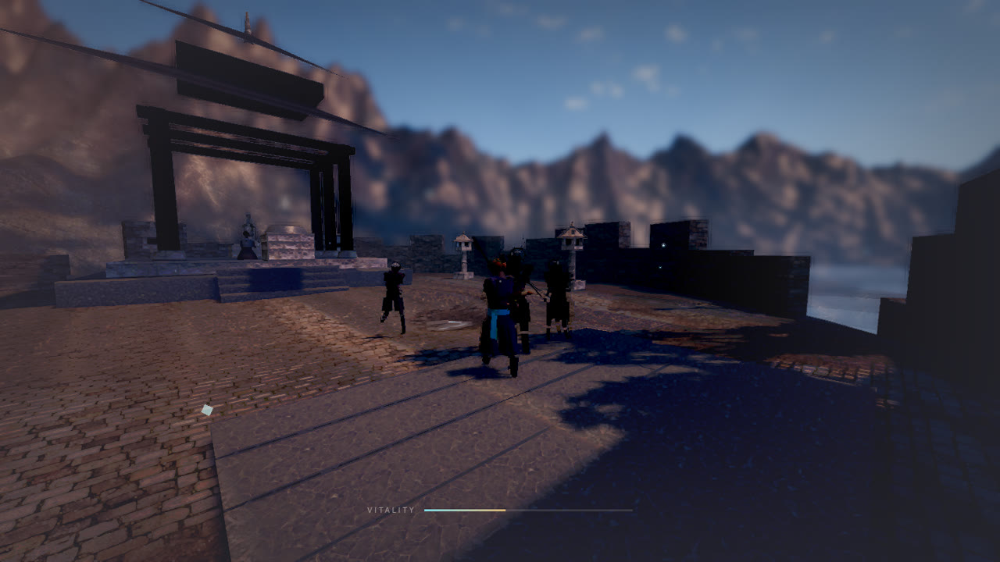
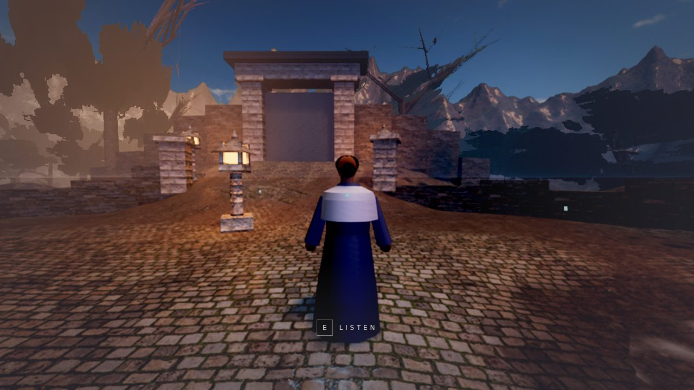
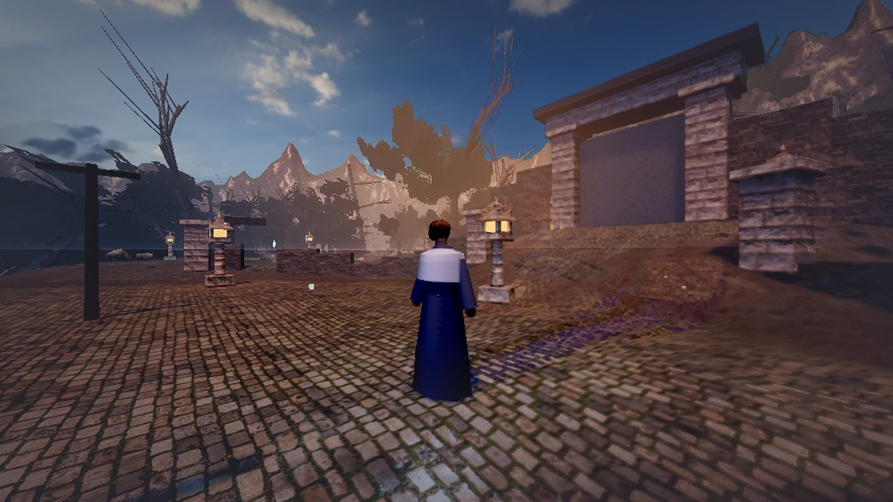
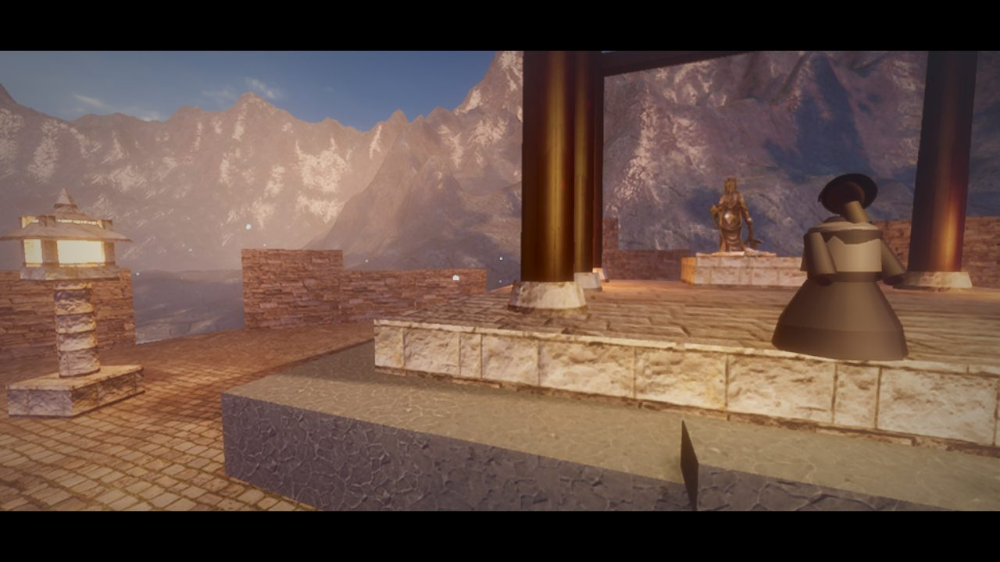
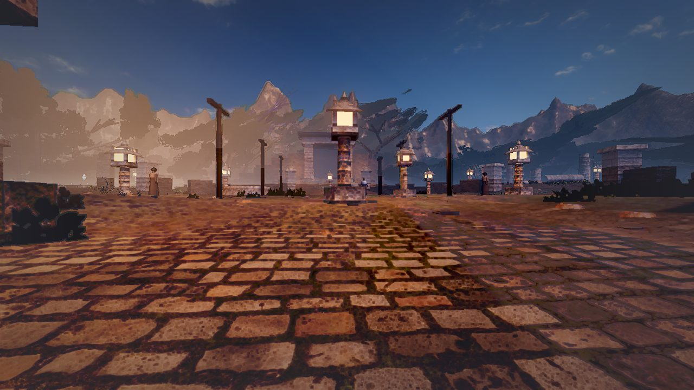

# Echoes of the Shrine

A small, cinematic exploration game that runs in the browser, with a short real-time melee loop on
top. You arrive at a forgotten mountain shrine just after rainfall, at dusk. Three ancient stones
sleep among the ruins. Something has followed you up the path. Wake the stones anyway.

Built on **PlayCanvas Engine 2.x** with a **WebGPU-first** renderer and an automatic **WebGL 2**
fallback. Everything is TypeScript, bundled with Vite. The world — terrain, architecture, foliage,
water, weather, particles, music and sound — is generated at runtime from a small set of CC0 source
textures and props; there are no baked levels and no audio files.

---

## Running it

```bash
npm install          # install dependencies
npm run dev          # dev server at http://localhost:5173
npm run build        # typecheck + production build into dist/
npm run preview      # serve the production build at http://localhost:4173
```

The runtime assets in `public/assets` are committed, so `npm run dev` works immediately after
install. To regenerate them from source (requires network access to Poly Haven):

```bash
node tools/download-assets.mjs    # fetch CC0 sources into assets-src/ (not committed)
node tools/pack-assets.mjs        # -> WebP textures + GLB models in public/assets
node tools/simplify-models.mjs    # decimate the scan meshes to game-ready budgets
```

Headless visual review (uses the bundled Chromium via Playwright):

```bash
node tools/shots.mjs --preset high --out screenshots/run \
  --views "gate:0,3.5,-27,180,2;court:0,3,-6,180,-3"
```

### Controls

| Input | Action |
| --- | --- |
| `W A S D` / arrows | Move |
| Mouse | Look (pointer lock; click the canvas to capture) |
| `Shift` | Sprint (widens FOV slightly) |
| `Space` | Hop |
| `E` | Attune to a stone, or greet a figure, when the prompt appears |
| **Left mouse** | Strike — three-hit katana combo |
| **Right mouse** | Heavy overhead slash |
| `Space` | Evade (dodge-cancels an incoming blow; it is Jump outside combat) |
| `Esc` | Settings / pause |

Useful URL parameters: `?preset=ultra|high|medium`, `?state=0..3` (jump to a world state),
`?encounter=0..2` (drop straight into a fight), `?webgl=1` (force the WebGL 2 path),
`?shot=1` (skip the title screen, for tooling).

---

## Project structure

```
src/
  core/        engine bootstrap (device selection), settings store, event emitter, debug hooks
  rendering/   lighting + mood system, global height fog, CameraFrame post-processing
  world/       terrain field & renderer, shrine architecture, scatter/instancing, water,
               trees, leaf-atlas generation, materials, level layout, procedural NPC figures
  player/      input, kinematic capsule collision, first-person controller
  combat/      fighter rig + pose animation, characters, weapons and trails, combat director, VFX
  gameplay/    game loop, director (states, stones, finale), energy stones, NPC director
  effects/     particle systems, god rays and mist banks
  shaders/     GLSL + WGSL chunk overrides (terrain, wet surfaces, wind, water, particles, stone)
  audio/       procedural Web Audio engine, synthesis helpers, formant singing voice
  ui/          loading screen, HUD, settings menu, stylesheet
  assets/      asset manifest / loader
  utils/       math, noise, geometry builders
tools/         asset download + packing pipeline, screenshot tools
public/assets/ packed runtime assets (textures, models, HDRI)
```

---

## Graphics techniques

**Rendering path**
- WebGPU requested first, automatic WebGL 2 fallback; every custom shader ships in both
  **WGSL and GLSL** so neither path is a downgrade in features.
- HDR scene target with ACES2 tone mapping through PlayCanvas' `CameraFrame` pipeline.

**Lighting**
- Image-based lighting from an HDRI: skybox cubemap + prefiltered environment atlas, rotated so the
  HDRI's sun agrees with the directional light.
- Low, warm key light raking in over the northern ridge with **cascaded shadow maps** (2–4 cascades
  by preset, PCSS soft shadows on Ultra/WebGPU), plus a cool sky-fill light so shadows read blue
  rather than black.
- **Clustered lighting** for the lantern and stone point lights — dozens of small lights at
  negligible cost.
- A *mood* system blends sun colour, intensity, exposure, ambient and fog between four authored
  states as the stones awaken.

**Custom shaders** (all GLSL + WGSL)
- *Terrain splat*: four PBR layers (forest floor, mossy rock, cobblestone, cliff) blended by slope,
  vertex-painted masks and height-map sharpening, with triplanar mapping on cliffs and macro-variation
  sampling to hide tiling.
- *Post-rain wetness*: darkened albedo and raised gloss driven by surface orientation, applied
  globally to architecture and props.
- *Puddles*: analytic ripple-ring gradients producing rain-drop normals on flat wet ground.
- *Water*: two scrolling layers of analytically-differentiated gradient noise for normals, expanding
  drip rings, depth-driven colour/gloss, Fresnel sky term, and an opacity fade that dissolves the
  shoreline so there is no hard rim.
- *Global height fog*: replaces the engine's fog chunk with an analytic height-integrated fog with
  sun in-scattering and animated 3D noise, shared by every material including particles.
- *Vertex wind*: height-weighted bending plus high-frequency flutter, phase-offset per world position
  so instances never move in lockstep; shared with the shadow pass so shadows agree with the geometry.
- *Energy stones*: additive faceted glow with a Fresnel rim, drifting interior bands and an
  activation shockwave.
- *Billboard particles*: `transformInstancingVS` is overridden to build a camera-facing basis
  directly from the instance stream, so the CPU never writes full matrices. The sprite falloff is
  computed analytically from the quad's UV rather than sampled — a 64 px sprite covering ~10 screen
  pixels lands on a high mip and comes back flat, which turned every dust mote into an opaque square.

**Atmosphere**
- Height + distance fog with sun in-scattering and drifting noise.
- Camera-anchored light shafts that fade as the sun leaves view, plus drifting ground-mist banks,
  both with near/far camera fades so cards never pop through the viewer.
- Five particle systems (dust, spores, drips, embers, energy motes) on a shared instanced pool.

**Vegetation**
- Procedural trees: recursive tapered branches with crossed leaf cards at the tips.
- Leaf atlases are **generated at runtime** onto a canvas — procedural leaf shapes, midribs and
  veins, modulated by a photographic detail texture, with a derived normal map and an alpha-bleed
  pass so mipmaps don't darken the silhouettes.
- Everything else is GPU-instanced from decimated CC0 scans with deterministic rejection sampling
  against slope, moss masks, path corridors and keep-out zones.

---

## Performance work

- **Hardware instancing everywhere**, grouped into spatial cells so frustum culling discards whole
  clusters; foliage density is a live setting that adjusts `instancingCount` rather than rebuilding
  buffers.
- **Merged draw calls**: all shrine architecture is built into per-material merged meshes.
- Chunked terrain with tight per-chunk bounds.
- Scan meshes decimated with meshoptimizer to game-ready budgets (typically 250–900 triangles for
  scatter props); textures packed to 1K WebP.
- Preallocated typed arrays for particle simulation — no allocation inside the frame loop.
- **Adaptive resolution**: median frame time over a sliding window nudges the render-target scale in
  5% steps to hold ~60 fps.
- Three presets (Ultra / High / Medium) controlling shadow resolution and distance, cascade count,
  SSAO samples, DOF quality, foliage and particle density, mist layers and render scale.
- Device pixel ratio capped so high-DPI displays don't quadruple the fragment load.
- Asynchronous, progressive world build that yields to the browser between phases so the loading
  screen keeps animating.

---

## Combat

The shrine is worth defending, so a small amount of real-time melee sits on top of the exploration.
The scope is fixed on purpose: **one player, one ally, three staged encounters of two to four
enemies**. There are no levels, no loot, no skill trees — the effort went into how a swing feels.

<p align="center">
  
  
  
  
</p>

**The cast.** A katana warrior (you, navy with cyan wraps), a nunchuck ally in black who joins
from the courtyard onward, and enemies in black with an orange sash and the hood up. All three are
builds of the **same rigged character**: one 65-joint skeleton, one outfit, one clip set, three
colourings. There is deliberately no second character system.

**The characters.** `tools/build-character.py --all` assembles the three GLBs offline from
public-domain packs — Quaternius' Universal rig, fantasy outfit and sword animation library, with
KayKit locomotion retargeted onto the same skeleton through matching T-poses (sources and licences
in `docs/CHARACTER_SOURCES.md`). The outfit atlas is recoloured per part from the mesh's own UV
islands, so a variant is a table of hues and value shifts, not a new texture. Root motion is baked
into a `RootMotion` node the actor reads back, so a lunge moves the character instead of sliding
the mesh off its capsule. The katana hangs off a socket under the right hand bone with a fitted
local transform; the nunchucks use the same socket. Materials are cloned per instance so a hit
flash lights one body, not every fighter.

**The animation** (`src/combat/skinned.ts`) drives PlayCanvas' `AnimEvaluator` directly: two
locomotion clips blended by real ground speed and kept in phase (the stride rate follows the speed
so feet do not skate), one action on top that fades in from wherever the body was and fades back
out over its last stretch, recoveries that chain after a slash, and holds for deaths. Each attack
clip carries its `swing` / `hitOpen` / `hitClose` events at normalised times, which is the only
thing that decides when the blade is dangerous. Hit reactions are an additive recoil on the spine
and head over whatever the body is doing (the packs have no light hit that keeps the feet planted),
so a flinch never breaks the pose it lands on. Breathing and a lean into travel sit on top.

**Hit detection** (`src/combat/hitdetect.ts`, `actor.ts`, `combat.ts`) is a swept blade, not a
radius. While an attack's window is pending or open the animation is advanced in sub-steps no
longer than 1/60 s and the blade's edge is recorded after each one; the samples are laid along the
root's motion for the frame and swept in order against every body capsule. Each sweep segment
rotates the blade direction rather than lerping the tip (a straight lerp cuts inside the arc
exactly where the swing reaches furthest) and is sub-divided by travel so a fast cut cannot tunnel.
A target is damaged once per swing, only inside the clip's active window, only in front of the
attacker, and only if an exact segment test against the level colliders finds nothing between the
attacker's chest and the contact point. The dodge opens 0.25 s of invulnerability. Because the
sampling rate is fixed and damage is event-driven, the same swing lands the same hit at 60, 30, 20
or 10 frames per second — the lab scripts assert exactly that. Every number lives in
`src/combat/config.ts`.

**Feel.** Blade contact → damage → spark → impact sound → recoil → hit-stop (35 ms light, 60 ms
heavy, 45 ms when you are hit) → a small camera impulse. A ribbon trail is rebuilt each frame from
the blade's recent positions. Attacks lunge you forward only as far as there is something to close
on.

**Enemy behaviour** is the state machine `idle → alert → approach → combatIdle → attack → recover
→ combatIdle`, plus `hit`, `stagger` and `dying`. An enemy notices you inside the alert radius,
closes to attack range, faces you, waits out its cooldown, swings, steps back, and repeats. A light
hit interrupts a wind-up half the time, is a short flinch outside a swing, and is absorbed during
the cut itself; a heavy always staggers. Waiting enemies hold ring slots with hysteresis, and
**only one enemy holds the attack token at a time**. A dead enemy never attacks: death clears the
window and the token on the frame it happens.

**Encounters** are staged along the existing route — two at the outer gate to teach the loop, three
in the courtyard where the ally arrives, and the elite at the awakened shrine. The camera swings out
to a third-person boom when a fight starts and eases back to first person when it clears.

**Debug and testing.** `F1` shows a stats panel (frame time, draw calls, action, lock, window,
i-frames, enemy states); `F2` draws the hurt capsules, every sweep chain (green while dangerous,
red on the frame it connects) and the contact points. Both are off in normal play. The
`window.__ECHOES` hooks (`arena`, `simulate`, `attack`, `setYaw`, `trace`, `enemyHealth`) let a
headless script stage a 1v1 and step it at any frame time without rendering; the hit, duel,
movement, wall and slope labs in the development log run on them.

---

## The people at the shrine

The shrine is not empty. Six procedural figures give the level scale and tell you, without a single
line of exposition, that someone still tends this place.

**Nova** stands at the head of the courtyard, and she sings. Her voice is synthesised live rather
than played back (`src/audio/voice.ts`): a sawtooth glottal source plus a sub-octave sine and a
breath-noise layer are pushed through three parallel band-pass filters tuned to real vowel formants,
with a vibrato oscillator driving `detune` and legato pitch glides between notes. She wanders a
pentatonic phrase with rests between them, so the melody never loops audibly. The voice is
spatialised through an HRTF panner, so it swells as you walk toward her and moves correctly as you
turn your head. Each stone you wake adds a harmony voice a third and a fifth above the root — by the
finale she is singing in three parts.

The other five are silent: a pilgrim walking the approach path back and forth, a figure kneeling in
seiza before the altar, and three watchers standing at the courtyard edge and by the ruin. Walking
close to any of them (except the one at prayer) offers `[E] GREET`, and they answer with a line.

All six are built from the same ~1,300-triangle procedural body (`src/world/npc.ts`), which is
designed for silhouette rather than detail because it is nearly always seen at distance through fog:

- The robe sections are generated with an **elliptical cross-section** and a **cosine radius
  modulation**, so the body is wider than it is deep and the cloth carries vertical folds. A plain
  cylinder here reads as a traffic cone.
- A pale **shawl over the shoulders** sits over a darker robe with the arms hanging clear of it.
  That wide-over-narrow value break is what makes a figure read as a person at 30 m.
- Head, hair and hands are separate materials, so there is a value break at the face instead of a
  featureless ball.
- Kneeling figures use their own proportion table (folded legs, pooled hem, shorter arms) rather
  than a squashed standing body.
- Idle animation is per-entity transform only — no skinning: breathing, a slow weight shift, head
  turn, arm swing on the walker, and figures glancing at you when you come within 14 m.

<p align="center">
  
  
  
  
</p>

Nova also carries a soft omni light that brightens with her song and with the shrine's state, which
is what lifts her off the dusk background in the wide courtyard shot.

---

## Audio

Entirely procedural Web Audio — no sound files ship with the game:

- Layered ambience: filtered pink-noise forest bed, a resonant wind filter on a random walk,
  occasional distant thunder, sparse crickets that thicken as the shrine wakes, and rain drips.
- Per-surface footsteps (stone, water, grass, rock, soil) with randomised pitch and level, plus
  landing and jump sounds.
- Spatialised (HRTF panner) shrine hums, water ambience, door grind and stone activations.
- A slow pentatonic score that layers in across four stages, climaxing with a swelling pad.
- Nova's formant singing voice (see above), spatialised and harmonised by world state.
- Combat: sword swings are filtered noise sweeps whose pitch tells you how heavy the blow was, and
  impacts add a short metallic ring plus a low thud, so a clean hit and a whiff sound different
  without any sample library.
- Convolution reverb from generated impulse responses, switched between open / courtyard / sanctum
  as the player moves.

---

## Known limitations

- **WebGPU could not be verified in this environment.** The headless Chromium available here exposes
  WebGL 2 only (SwiftShader), so every screenshot in `screenshots/` is from the WebGL 2 fallback
  path. The WebGPU path is implemented — WGSL is provided for every custom chunk and the device is
  requested first — but it has not been run on real hardware.
- Frame rates here are software-rasteriser numbers and are not representative. They are also worse
  than earlier versions of this file claimed: the old counter divided by the frame delta, which the
  engine clamps to `maxDeltaTime`, so it reported a flat "10 fps" that was really just `1/0.1`. The
  honest figure on SwiftShader is closer to **1 fps**. Triangle load at High is roughly 5–11M
  submitted before culling; a real GPU should hold 60, but that has not been measured on one.
- Because of that, combat is verified by stepping the simulation directly rather than in wall-clock
  time — `__ECHOES.simulate(seconds)` advances the fight without rendering, which is how the
  encounter, hit-detection and defeat paths are regression-tested.
- The sky reads bluer than a true dusk. Raising `skyIntensity` was what stopped unlit verticals
  (torii legs, banner posts, the sealed doors) from crushing to flat black, but in PlayCanvas that
  one value scales both the image-based lighting and the visible sky dome, so the fix for the
  shadow side also brightened the sky. Decoupling them means splitting the env-atlas contribution
  from the skybox render rather than grading the whole frame down.
- Particles use a distance fade rather than true soft-particle depth intersection.
- Light shafts and mist are camera-anchored cards, not true volumetrics.
- No Gaussian splats: no suitably-licensed capture of a shrine environment was available, and
  splats would not have provided the collision the gameplay needs.
- Collision is analytic (boxes, cylinders, heightfield) rather than a full physics engine — it is
  tuned for walking, and you can find places to stand on that a physics capsule would slide off.
- The leaf atlases are generated per session on the CPU; on very slow machines this adds about a
  second to load.

- The player is a skinned character; the ally and the enemies are still the flat-shaded articulated
  solids from the previous pass, so their limbs bend at the joint without the geometry deforming.
  They are next in line for the same pipeline once the player has passed review.
- The player's walk and run are KayKit clips retargeted from a much shorter rig, so the stride reads a
  little wide; the sword clips are native to the skeleton.

## Next five upgrades that would most improve the visuals

1. **True soft particles and depth-aware mist** by sampling the scene depth buffer, removing the
   remaining hard intersections where cards meet geometry.
2. **Screen-space reflections** on the wet stone and pools, which is where a post-rain scene gets
   most of its expensive look; the Fresnel sky term is currently standing in for it.
3. **Baked or voxel-based indirect light** in the courtyard and sanctum so bounce light from the
   lanterns actually spills onto the surrounding walls.
4. **Real tree assets with LODs and imposters**, replacing the procedural cards — canopy silhouette
   is the weakest remaining element and imposters would let the forest be several times denser.
5. **A WebGPU compute path for the particles**, moving the simulation off the CPU so the dust and
   ember counts can go up by an order of magnitude, with GPU sorting for correct alpha blending.

---

## Asset credits

All third-party assets are **CC0** from [Poly Haven](https://polyhaven.com/license): PBR texture
sets, the `kloppenheim_06` HDRI, and the scanned rock / plant / lantern / statue props listed in
`tools/download-assets.mjs`. They are repacked (WebP, decimated GLB) by the tools in `tools/`.
All shaders, geometry, audio and code in `src/` are original.

---

## Demo trailer

`demo/echoes-of-the-shrine.mp4` — a 48-second narrated trailer (1600×900, H.264 + AAC).

It is cut from real rendered frames of the game, narrated by **Nova** — who is a character in the
level, not just a voice-over — with an original procedural score. Four of the seventeen shots are
there to establish that the shrine is still tended: the courtyard with figures at two depths, Nova
herself, a watcher alone at the edge, and the figure kneeling before the altar. Regenerate the
whole thing with:

```bash
node tools/capture-plates.mjs demo/plates    # render the still plates from the running game (~16 min)
node tools/render-captions.mjs demo/caps     # Nova's narration as transparent PNG overlays
node tools/make-soundtrack.mjs --seconds 48.5 --out demo/score.wav
node tools/build-trailer.mjs                 # Ken Burns + cross-dissolves + captions + score
```

The cut itself lives in `tools/trailer-shots.mjs` and is shared by the last two steps, so a caption
names the shot it sits over (`over: '15-nova.png'`) rather than a hand-computed fraction of the
running time. Changing a shot's length re-times its narration automatically instead of silently
sliding the line onto the wrong picture.

**Why a montage rather than a real-time capture.** This environment has no GPU: the game runs on
Chromium's SwiftShader software rasteriser, where a single frame of this scene costs 20–30 seconds.
A 48-second capture at 24 fps would take over six hours, so `tools/capture-video.mjs` (which drives
the camera by frame index and would produce a true flythrough) is included but impractical here.
Instead `capture-plates.mjs` renders seventeen high-quality stills along the intended camera path and
`build-trailer.mjs` cuts them together with slow moves. Every frame is genuine engine output —
it is edited motion, not live gameplay footage. On a machine with a real GPU, run
`tools/capture-video.mjs` for the flythrough version.

The score (`tools/make-soundtrack.mjs`) is synthesised from scratch — minor-pentatonic plucks over a
drone, a wind bed, and a pad that blooms for the finale — mirroring the in-game audio design. Nova
is an original fictional narrator; no real person is depicted or implied.
